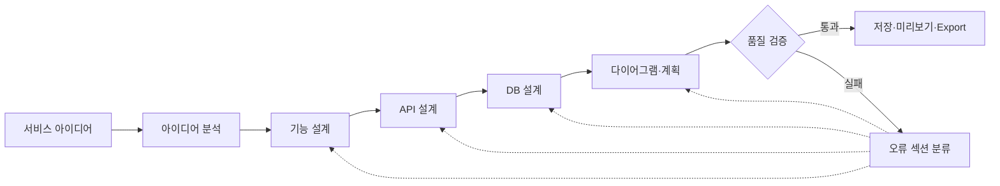

<div align="center">

# DevBlueprint AI

### 아이디어를 구현 가능한 시스템 설계도로

자연어로 작성한 서비스 아이디어를 분석해 기능, API, 데이터베이스, 다이어그램과 구현 계획까지 하나의 설계도로 완성하는 AI 기반 설계 도구입니다.


</div>

---

## 서비스 소개

아이디어를 실제 개발로 옮기려면 기능 범위, API 계약, 데이터 모델, 보안과 구현 순서를 함께 결정해야 합니다. DevBlueprint AI는 이 과정을 역할별 설계 파이프라인으로 나누고, 결과를 서로 연결된 하나의 개발 청사진으로 제공합니다.

> “동네 풋살장을 예약하고 부족한 인원을 매칭해 주는 서비스를 만들고 싶어요.”

한 문장의 아이디어는 다음 산출물로 확장됩니다.

| 설계 영역 | 생성 결과 |
| --- | --- |
| 제품 정의 | 서비스 개요, 핵심 기능, 우선순위 |
| 기술 설계 | 추천 기술 스택과 선정 근거 |
| 백엔드 | REST API, 요청·응답 필드 |
| 데이터 | PostgreSQL 스키마, Mermaid ERD |
| 사용자 흐름 | Mermaid 시퀀스 다이어그램 |
| 운영 준비 | 비기능 요구사항, 보안 고려사항 |
| 실행 계획 | 단계별 MVP 구현 순서 |

## 핵심 기능

### 역할별 설계 오케스트레이션

LangGraph가 아이디어 분석, 기능, API, 데이터베이스, 다이어그램, 구현 계획을 담당하는 specialist 노드를 순서대로 연결합니다. 각 결과는 다음 단계의 입력으로 사용되어 설계 전체의 맥락을 유지합니다.

### 검증 기반 재시도

생성 결과를 그대로 노출하지 않습니다. 기능 범위, API 경로, DB 기본키, Mermaid 형식과 구현 계획을 검증하고, 실패 원인에 따라 필요한 섹션부터 다시 생성합니다. 오류가 여러 개면 `기능 → API → DB → 다이어그램 → 계획` 순서로 의존성을 복구합니다.

### 안전한 설계 개선

저장된 설계도에 수정 요청을 남기거나 특정 섹션만 다시 생성할 수 있습니다. 재생성 결과는 먼저 미리보기로 제공되며, 사용자가 적용하기 전까지 원본을 변경하지 않습니다.

### 다이어그램 안정화

LLM이 만든 Mermaid 코드를 저장 전과 렌더링 전에 정규화합니다. ERD와 시퀀스 다이어그램은 독립적으로 렌더링되어 하나의 문법 오류가 다른 결과까지 가리지 않습니다.

### 실행 이력과 산출물

노드별 실행 상태, specialist, Retry 횟수, 오류 내용과 소요 시간을 기록합니다. 완성된 설계도는 Markdown 또는 개발 문서와 Mermaid 원본이 포함된 ZIP 패키지로 내보낼 수 있습니다.

## 설계 흐름



검증 실패 시 전체 결과를 무조건 다시 만들지 않고, 오류가 발생한 섹션과 그 영향을 받는 하위 설계만 재생성합니다.

## 기술 구조

```text
React / Vite
    └── FastAPI
          ├── LangGraph 설계 파이프라인
          ├── OpenAI Structured Outputs
          ├── Pydantic 품질 검증
          ├── Mermaid 정규화
          └── Repository
                ├── In-memory
                └── PostgreSQL / SQLAlchemy / Alembic
```

| 영역 | 기술 |
| --- | --- |
| Frontend | React, Vite, Mermaid |
| Backend | Python, FastAPI, Pydantic |
| AI orchestration | OpenAI Structured Outputs, LangGraph |
| Data | PostgreSQL, SQLAlchemy, Alembic |
| Quality | pytest, schema validation, prompt regression samples |

## 신뢰성과 품질

- 구조화된 출력 스키마로 LLM 응답 형태 고정
- 품질 검증 오류를 수정 지시로 변환해 Retry에 전달
- 동일한 아이디어의 결과를 캐시로 재사용
- Mermaid code fence, SQL 타입, key token과 제약 조건 정규화
- API 오류를 원인 코드와 사용자 안내 메시지로 분리
- LangGraph 실행 이력과 단계별 소요 시간 저장
- 백엔드 자동 테스트 `98 passed`
- React 프로덕션 빌드 검증 완료

## 결과 예시

- [배드민턴 복식 팀 매칭 서비스 설계도](docs/examples/%EB%B0%B0%EB%93%9C%EB%AF%BC%ED%84%B4%20%EB%B3%B5%EC%8B%9D%20%ED%8C%80%20%EB%A7%A4%EC%B9%AD%20%EC%84%9C%EB%B9%84%EC%8A%A4.md)

## 프로젝트 상태

현재 버전은 설계도 생성부터 저장, 개선, 부분 재생성, 실행 추적과 Export까지 이어지는 제품형 MVP입니다. 단일 사용자 환경을 기준으로 완성되어 있으며, 다음 단계는 긴 생성 요청의 비동기 작업 전환과 사용자·워크스페이스 격리입니다.

자세한 기준과 향후 설계는 아래 문서에서 확인할 수 있습니다.

- [설계도 품질 기준](docs/BLUEPRINT_QUALITY_CHECKLIST.md)
- [OpenAI 회귀 테스트 샘플](docs/OPENAI_REGRESSION_SAMPLES.md)
- [배포·운영 체크리스트](docs/DEPLOYMENT.md)
- [사용자·워크스페이스 로드맵](docs/WORKSPACE_ROADMAP.md)

---

<div align="center">

DevBlueprint AI는 완성된 코드를 대신 만드는 도구가 아니라, 개발을 시작할 수 있는 명확한 첫 설계를 만드는 도구입니다.

</div>
