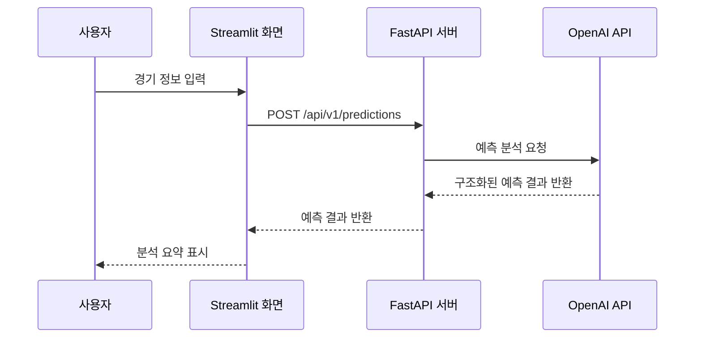

# DevBlueprint AI Example Result

## Input

스포츠 야구 분석 및 승부 예측 서비스

## Overview

야구 경기 데이터와 팀/선수 상태를 바탕으로 경기 분석과 승부 예측 결과를 제공하는 MVP입니다. 초기 버전은 사용자 입력, 예측 요청, 결과 조회, 기본 분석 요약에 집중합니다.

## Features

- **경기 분석 요청** `high`: 사용자가 분석하고 싶은 경기 정보를 입력하면 핵심 분석 결과를 생성합니다.
- **승부 예측 결과 제공** `high`: 팀 전력, 최근 흐름, 주요 변수 기반의 예측 결과를 제공합니다.
- **분석 이력 조회** `medium`: 사용자가 이전에 생성한 예측 결과를 다시 확인할 수 있게 합니다.
- **결과 요약 시각화** `medium`: 예측 근거와 주요 변수를 읽기 쉬운 형태로 보여줍니다.

## Tech Stack

- Backend: FastAPI, Pydantic
- Frontend: Streamlit
- Database: PostgreSQL
- AI: OpenAI API
- Rationale: MVP에서는 FastAPI와 Streamlit으로 빠르게 기능을 검증하고, PostgreSQL은 예측 요청과 결과 저장이 필요할 때 추가합니다.

## API Spec

### POST /api/v1/predictions

경기 정보를 받아 승부 예측을 생성합니다.

#### Request

- `home_team` (string, required): 홈 팀 이름입니다.
- `away_team` (string, required): 원정 팀 이름입니다.
- `game_date` (string, required): 경기 날짜입니다.

#### Response

- `prediction_id` (string, required): 생성된 예측 결과 ID입니다.
- `summary` (string, required): 승부 예측 요약입니다.
- `confidence` (number, required): 예측 신뢰도입니다.

### GET /api/v1/predictions/{prediction_id}

생성된 승부 예측 결과를 조회합니다.

#### Request

- `prediction_id` (string, required): 조회할 예측 결과 ID입니다.

#### Response

- `prediction_id` (string, required): 예측 결과 ID입니다.
- `summary` (string, required): 승부 예측 요약입니다.
- `factors` (array, required): 예측에 사용된 주요 변수 목록입니다.

## Database Schema

### predictions

사용자의 경기 예측 요청과 생성 결과를 저장합니다.

- `id` (uuid, primary_key): 예측 결과 고유 ID입니다.
- `home_team` (varchar, not_null): 홈 팀 이름입니다.
- `away_team` (varchar, not_null): 원정 팀 이름입니다.
- `game_date` (date, not_null): 경기 날짜입니다.
- `result` (jsonb, not_null): 예측 결과 JSON입니다.
- `created_at` (timestamp, not_null): 생성 시각입니다.

## Sequence Diagram

