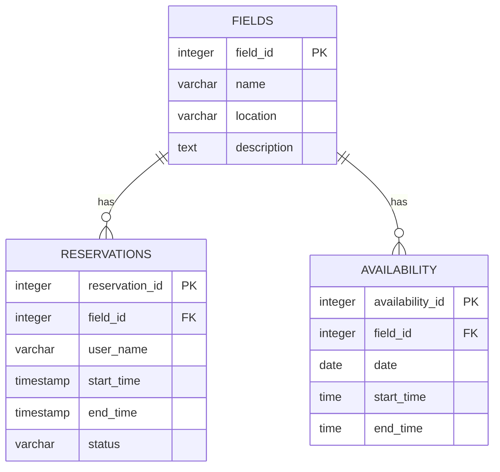
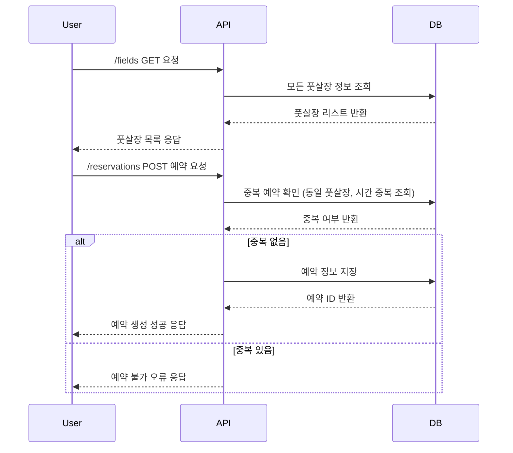

# DevBlueprint AI Result

## Overview
이 서비스는 사용자들이 풋살장을 쉽고 편리하게 예약할 수 있도록 하는 예약 시스템입니다. 사용자는 풋살장 목록을 조회하고 원하는 시간대에 예약할 수 있으며, 관리자 또는 풋살장 소유자는 시설 정보를 관리할 수 있습니다.

## Features
- **풋살장 목록 조회** `high`: 사용자가 등록된 풋살장들을 조회할 수 있습니다.
- **예약 생성 및 관리** `high`: 사용자가 원하는 풋살장과 시간대를 선택하여 예약을 생성하고, 예약 내역을 조회할 수 있습니다.
- **예약 가능한 시간대 관리** `medium`: 풋살장의 예약 가능 시간을 관리할 수 있습니다.
- **풋살장 정보 관리** `medium`: 관리자가 풋살장 정보를 등록, 수정, 삭제할 수 있습니다.
- **예약 충돌 방지** `high`: 같은 시간대, 같은 풋살장 중복 예약을 방지합니다.
- **사용자 예약 내역 조회** `high`: 사용자가 자신의 예약 내역을 확인할 수 있습니다.

## Tech Stack
- Backend: FastAPI, Pydantic
- Frontend: Streamlit
- Database: PostgreSQL
- AI: none
- Rationale: FastAPI는 빠르고 효율적인 REST API 개발에 적합하며, Pydantic으로 데이터 검증을 쉽게 수행할 수 있습니다. Streamlit은 빠른 프로토타이핑에 유리한 프론트엔드 도구입니다. PostgreSQL은 관계형 데이터베이스로 예약 시스템에 적합한 무결성 제약 조건을 지원합니다.

## API Spec
### GET /fields
등록된 모든 풋살장 목록 조회

#### Request
- 없음

#### Response
- `field_id` (integer, required): 풋살장 고유 ID 
- `name` (string, required): 풋살장 이름 
- `location` (string, required): 풋살장 위치 정보 
- `description` (string, optional): 풋살장 상세 설명 

### POST /reservations
새 예약 생성

#### Request
- `field_id` (integer, required): 예약할 풋살장 ID 
- `user_name` (string, required): 예약자 이름 
- `start_time` (string, required): 예약 시작 시간 (ISO 8601 형식) 
- `end_time` (string, required): 예약 종료 시간 (ISO 8601 형식) 

#### Response
- `reservation_id` (integer, required): 생성된 예약 ID 
- `status` (string, required): 예약 상태 (예: confirmed) 

### GET /reservations/{reservation_id}
특정 예약 정보 조회

#### Request
- 없음

#### Response
- `reservation_id` (integer, required): 예약 ID 
- `field_id` (integer, required): 풋살장 ID 
- `user_name` (string, required): 예약자 이름 
- `start_time` (string, required): 예약 시작 시간 
- `end_time` (string, required): 예약 종료 시간 
- `status` (string, required): 예약 상태 

### GET /reservations
사용자 예약 목록 조회 (user_name 으로 필터링)

#### Request
- `user_name` (string, required): 예약자 이름으로 필터링

#### Response
- `reservation_id` (integer, required): 예약 ID
- `field_id` (integer, required): 풋살장 ID 
- `start_time` (string, required): 예약 시작 시간 
- `end_time` (string, required): 예약 종료 시간 
- `status` (string, required): 예약 상태 

### PUT /fields/{field_id}
풋살장 정보 수정

#### Request
- `name` (string, optional): 풋살장 이름 
- `location` (string, optional): 풋살장 위치 
- `description` (string, optional): 풋살장 상세 설명 

#### Response
- `field_id` (integer, required): 풋살장 ID 
- `name` (string, required): 풋살장 이름 
- `location` (string, required): 위치 
- `description` (string, required): 상세 설명 

### GET /fields/{field_id}/availability
특정 풋살장 예약 가능 시간 조회

#### Request
- `date` (string, required): 조회할 날짜 (YYYY-MM-DD)

#### Response
- `available_slots` (array, required): 예약 가능한 시간대 리스트 (ISO 8601 시간 범위)

## Database Schema
### fields
풋살장 정보를 저장하는 테이블

- `field_id` (serial, PRIMARY KEY): 풋살장 고유 ID
- `name` (varchar(100), NOT NULL): 풋살장 이름
- `location` (varchar(255), NOT NULL): 위치
- `description` (text, none): 상세 설명

### reservations
예약 정보를 저장하는 테이블

- `reservation_id` (serial, PRIMARY KEY): 예약 고유 ID
- `field_id` (integer, NOT NULL, FOREIGN KEY REFERENCES fields(field_id)): 풋살장 ID
- `user_name` (varchar(100), NOT NULL): 예약자 이름
- `start_time` (timestamp, NOT NULL): 예약 시작 시간
- `end_time` (timestamp, NOT NULL): 예약 종료 시간
- `status` (varchar(20), NOT NULL): 예약 상태

### availability
풋살장별 예약 가능 시간대를 저장하는 테이블

- `availability_id` (serial, PRIMARY KEY): 고유 ID
- `field_id` (integer, NOT NULL, FOREIGN KEY REFERENCES fields(field_id)): 풋살장 ID
- `date` (date, NOT NULL): 적용 날짜
- `start_time` (time, NOT NULL): 시작 시간
- `end_time` (time, NOT NULL): 종료 시간

## Database ERD

## Sequence Diagram

