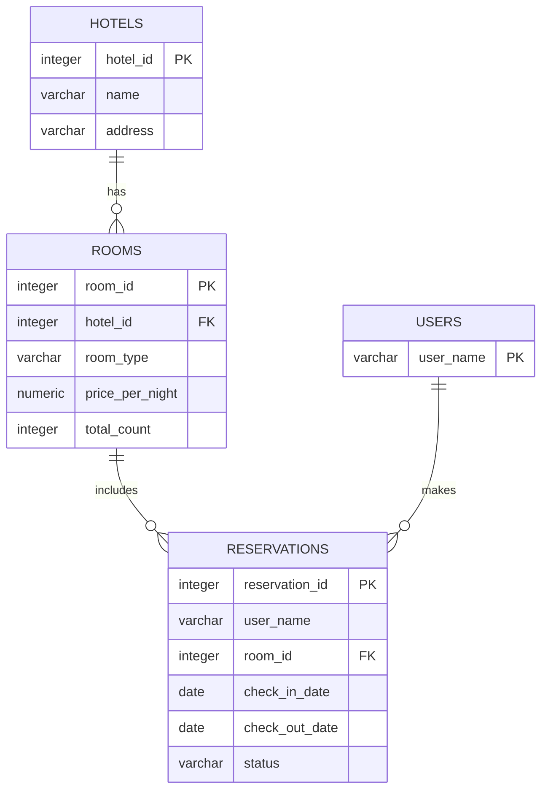
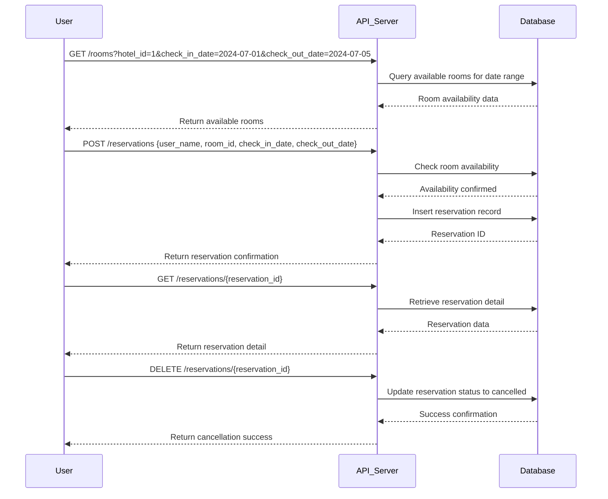

# DevBlueprint AI Result

## Overview
본 호텔 룸 예약 서비스는 사용자가 호텔 객실을 검색, 예약, 취소할 수 있도록 하는 웹 기반 서비스입니다. 간단한 예약 관리 시스템으로, 호텔 객실 정보와 예약 현황을 관리하며 사용자 친화적인 API를 제공합니다.

## Features
- **호텔 객실 검색** `high`: 사용자가 원하는 날짜와 조건에 맞는 이용 가능한 객실을 조회할 수 있습니다.
- **객실 예약 생성** `high`: 사용자가 선택한 객실을 예약할 수 있으며, 예약 가능 여부를 실시간으로 확인합니다.
- **예약 취소** `medium`: 사용자가 기존 예약을 취소할 수 있습니다.
- **예약 내역 조회** `medium`: 사용자가 자신의 예약 내역을 확인할 수 있습니다.
- **호텔 및 객실 정보 관리** `low`: 관리자는 호텔과 객실 정보를 등록, 수정할 수 있습니다.
- **잔여 객실 재고 관리** `high`: 시스템은 객실별 예약 현황에 따라 잔여 객실 수를 관리합니다.

## Tech Stack
- Backend: FastAPI, Pydantic
- Frontend: Streamlit (추가 개발 시)
- Database: PostgreSQL
- AI: none
- Rationale: FastAPI와 Pydantic을 사용하여 빠르고 타입 안정적인 API 서버를 구현합니다. PostgreSQL은 관계형 데이터에 적합하며, 예약 시스템에 신뢰성 있는 트랜잭션 관리가 가능합니다. Streamlit은 프론트엔드 MVP 개발에 적합하므로 추후 확장에 용이합니다.

## API Spec
### GET /hotels
호텔 목록 및 기본 정보 조회

#### Request
- 없음

#### Response
- `hotel_id` (integer, required): 호텔 고유 ID.
- `name` (string, required): 호텔 이름.
- `address` (string, required): 호텔 주소.

### GET /rooms
호텔 객실 검색 (호텔 ID 및 날짜별 가능 여부 포함)

#### Request
- `hotel_id` (integer, optional): 조회할 호텔 ID. (선택)
- `check_in_date` (string, required): 체크인 날짜 (YYYY-MM-DD)
- `check_out_date` (string, required): 체크아웃 날짜 (YYYY-MM-DD)

#### Response
- `room_id` (integer, required): 객실 고유 ID.
- `room_type` (string, required): 객실 종류 (예: 싱글, 더블 등)
- `price_per_night` (number, required): 1박당 가격
- `available_count` (integer, required): 해당 기간 동안 예약 가능한 객실 수

### POST /reservations
새 객실 예약 생성

#### Request
- `user_name` (string, required): 예약자 이름
- `room_id` (integer, required): 예약할 객실 ID
- `check_in_date` (string, required): 체크인 날짜 (YYYY-MM-DD)
- `check_out_date` (string, required): 체크아웃 날짜 (YYYY-MM-DD)

#### Response
- `reservation_id` (integer, required): 생성된 예약 고유 ID
- `status` (string, required): 예약 상태 (confirmed)

### GET /reservations/{reservation_id}
예약 상세 조회

#### Request
- 없음

#### Response
- `reservation_id` (integer, required): 예약 ID
- `user_name` (string, required): 예약자 이름
- `room_id` (integer, required): 객실 ID
- `check_in_date` (string, required): 체크인 날짜
- `check_out_date` (string, required): 체크아웃 날짜
- `status` (string, required): 예약 상태

### DELETE /reservations/{reservation_id}
예약 취소

#### Request
- 없음

#### Response
- `success` (boolean, required): 취소 성공 여부

### GET /users/{user_name}/reservations
사용자별 예약 내역 조회

#### Request
- 없음

#### Response
- `reservation_id` (integer, required): 예약 ID
- `room_id` (integer, required): 객실 ID
- `check_in_date` (string, required): 체크인 날짜
- `check_out_date` (string, required): 체크아웃 날짜
- `status` (string, required): 예약 상태

## Database Schema
### hotels
호텔 정보 테이블

- `hotel_id` (serial, PRIMARY KEY): 호텔 고유 ID
- `name` (varchar(100), NOT NULL): 호텔 이름
- `address` (varchar(200), NOT NULL): 호텔 주소

### rooms
호텔 객실 정보 테이블

- `room_id` (serial, PRIMARY KEY): 객실 고유 ID
- `hotel_id` (integer, NOT NULL, FOREIGN KEY REFERENCES hotels(hotel_id)): 소속 호텔 ID
- `room_type` (varchar(50), NOT NULL): 객실 종류
- `price_per_night` (numeric(10,2), NOT NULL): 1박 가격
- `total_count` (integer, NOT NULL): 해당 객실 유형 총 보유 객실 수

### reservations
객실 예약 테이블

- `reservation_id` (serial, PRIMARY KEY): 예약 고유 ID
- `user_name` (varchar(100), NOT NULL): 예약자 이름
- `room_id` (integer, NOT NULL, FOREIGN KEY REFERENCES rooms(room_id)): 예약 객실 ID
- `check_in_date` (date, NOT NULL): 체크인 날짜
- `check_out_date` (date, NOT NULL): 체크아웃 날짜
- `status` (varchar(20), NOT NULL): 예약 상태 (confirmed, cancelled 등)

### users
사용자 정보 테이블 (확장 가능)

- `user_name` (varchar(100), PRIMARY KEY): 사용자 이름, Primary Key로 사용

## Database ERD

## Sequence Diagram

