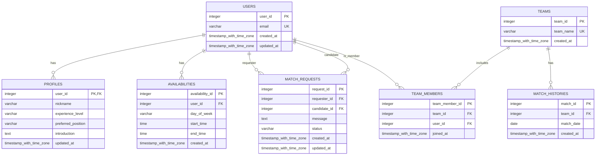
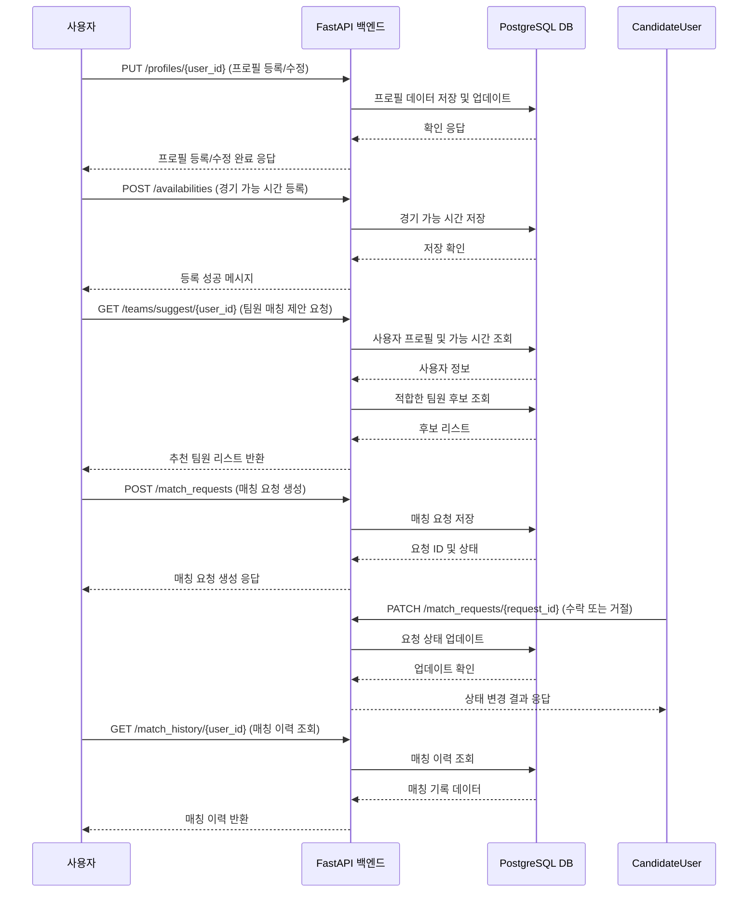

# DevBlueprint AI Result

## Overview
배드민턴 복식 팀 매칭 서비스는 배드민턴 복식 플레이어들이 자신의 프로필과 경기 가능 시간을 입력하여 최적의 팀원을 쉽고 빠르게 찾고 매칭할 수 있는 플랫폼입니다. 사용자는 매칭 요청을 주고받으며 팀을 구성하고, 매칭 이력을 관리하여 지속적인 복식 활동을 지원받습니다.

## Features
- **사용자 프로필 관리** `high`: 사용자는 자신의 개인 정보, 배드민턴 경험, 선호 포지션 등을 포함한 프로필을 등록 및 수정할 수 있습니다.
- **경기 가능 시간 등록** `high`: 사용자는 자신이 경기에 참여할 수 있는 시간을 등록하고 수정할 수 있어 매칭 시 반영됩니다.
- **매칭 요청 생성 및 응답** `high`: 사용자는 팀원 후보에게 매칭 요청을 보내고, 받은 요청을 수락하거나 거절할 수 있습니다.
- **복식 팀 자동 매칭 제안** `high`: 사용자의 프로필과 경기 가능 시간을 분석하여 적합한 팀원을 자동으로 추천합니다.
- **매칭 이력 관리** `medium`: 사용자는 이전 매칭 기록과 팀 구성을 확인할 수 있어 활동 내역을 관리할 수 있습니다.
- **팀 정보 관리** `medium`: 매칭이 완료된 팀은 팀 이름과 구성원 정보를 관리할 수 있습니다.
- **경기 일정 관리** `medium`: 사용자와 팀은 예정된 경기 일정을 등록하고 확인할 수 있습니다.

## Tech Stack
- Backend: FastAPI, SQLAlchemy
- Frontend: React
- Database: PostgreSQL
- AI: Optional - simple matching algorithm implemented in backend
- Rationale: FastAPI와 SQLAlchemy를 통해 빠르고 효율적인 백엔드를 구현하며, React로 직관적인 UI를 제공합니다. PostgreSQL은 구조화된 복식 팀, 사용자, 경기 데이터를 안정적으로 저장합니다. AI는 매칭 알고리즘 구현에 선택적으로 활용하여 팀 맞춤형 제안을 돕습니다.

## API Spec
### GET /profiles/{user_id}
특정 사용자의 프로필 정보 조회

#### Request
- `user_id` (integer, required): 조회할 사용자의 고유 ID (경로 파라미터)

#### Response
- `user_id` (integer, required): 사용자 고유 ID, PK로 사용됨.
- `nickname` (string, required): 사용자 닉네임
- `experience_level` (string, required): 배드민턴 경험 수준 (초급, 중급, 고급 등)
- `preferred_position` (string, required): 선호하는 팀 내 위치 (예: 앞, 뒤 등)
- `introduction` (string, optional): 자기소개 또는 추가 정보

### PUT /profiles/{user_id}
자기 자신 프로필 등록 및 수정

#### Request
- `user_id` (integer, required): 수정할 사용자 고유 ID (경로 파라미터)
- `nickname` (string, required): 사용자 닉네임
- `experience_level` (string, required): 배드민턴 경험 수준
- `preferred_position` (string, required): 선호하는 팀 내 위치
- `introduction` (string, optional): 자기소개 또는 추가 정보

#### Response
- `user_id` (integer, required): 수정된 사용자 고유 ID
- `message` (string, required): 수정 성공 메시지

### POST /availabilities
경기 가능 시간 등록

#### Request
- `user_id` (integer, required): 사용자의 고유 ID
- `day_of_week` (string, required): 가능 시간의 요일 (예: Monday)
- `start_time` (string, required): 가능 시작 시간 (HH:MM, 24시간 형식)
- `end_time` (string, required): 가능 종료 시간 (HH:MM, 24시간 형식)

#### Response
- `availability_id` (integer, required): 등록된 경기 가능 시간 고유 ID
- `message` (string, required): 등록 성공 메시지

### GET /availabilities/{user_id}
특정 사용자의 경기 가능 시간 조회

#### Request
- `user_id` (integer, required): 조회할 사용자 고유 ID (경로 파라미터)

#### Response
- `availability_id` (integer, required): 경기 가능 시간 고유 ID
- `day_of_week` (string, required): 가능 요일
- `start_time` (string, required): 시작 시간
- `end_time` (string, required): 종료 시간

### POST /match_requests
매칭 요청 생성

#### Request
- `requester_id` (integer, required): 요청을 보내는 사용자 ID
- `candidate_id` (integer, required): 매칭 요청 대상자 ID
- `message` (string, optional): 요청 메시지(선택)

#### Response
- `request_id` (integer, required): 생성된 매칭 요청 고유 ID
- `status` (string, required): 요청 상태 (예: pending)

### PATCH /match_requests/{request_id}
매칭 요청 수락 또는 거절

#### Request
- `request_id` (integer, required): 수정할 매칭 요청 ID (경로 파라미터)
- `status` (string, required): 변경할 상태 ('accepted' 또는 'rejected')

#### Response
- `request_id` (integer, required): 수정된 매칭 요청 ID
- `status` (string, required): 현재 상태

### GET /teams/suggest/{user_id}
사용자 프로필과 가능 시간에 기반한 자동 팀원 매칭 제안

#### Request
- `user_id` (integer, required): 매칭 제안을 받을 사용자 ID (경로 파라미터)

#### Response
- `suggested_team_members` (array, required): 추천 팀원 리스트

### GET /match_history/{user_id}
사용자 매칭 이력 조회

#### Request
- `user_id` (integer, required): 조회할 사용자 ID (경로 파라미터)

#### Response
- `match_id` (integer, required): 매칭 기록 ID
- `team_id` (integer, required): 팀 ID
- `matched_user_ids` (array, required): 팀원 사용자 ID 리스트
- `match_date` (string, required): 매칭 일자 (ISO 8601 형식)

## Database Schema
### users
사용자 계정 및 기본 정보 저장 테이블

- `user_id` (serial, primary_key): 사용자 고유 ID
- `email` (varchar(255), unique, not_null): 사용자 이메일 주소
- `created_at` (timestamp with time zone, not_null): 계정 생성 시각
- `updated_at` (timestamp with time zone, not_null): 계정 정보 최종 수정 시각

### profiles
사용자 배드민턴 프로필 정보 저장 테이블

- `user_id` (integer, primary_key, foreign_key(users.user_id)): 사용자 고유 ID (users 테이블 외래키)
- `nickname` (varchar(50), not_null): 사용자 닉네임
- `experience_level` (varchar(20), not_null): 배드민턴 경험 수준 (예: 초급, 중급, 고급)
- `preferred_position` (varchar(20), not_null): 선호 팀 내 위치 (예: 앞, 뒤)
- `introduction` (text, none): 자기소개 또는 추가 정보
- `updated_at` (timestamp with time zone, not_null): 프로필 최종 수정 시각

### availabilities
사용자 경기 가능 시간 저장 테이블

- `availability_id` (serial, primary_key): 경기 가능 시간 고유 ID
- `user_id` (integer, not_null, foreign_key(users.user_id)): 사용자 고유 ID (users 테이블 외래키)
- `day_of_week` (varchar(10), not_null): 가능 요일 (예: Monday)
- `start_time` (time without time zone, not_null): 가능 시작 시간 (24시간 HH:MM)
- `end_time` (time without time zone, not_null): 가능 종료 시간 (24시간 HH:MM)
- `created_at` (timestamp with time zone, not_null): 등록 시각

### match_requests
매칭 요청 정보 저장 테이블

- `request_id` (serial, primary_key): 매칭 요청 고유 ID
- `requester_id` (integer, not_null, foreign_key(users.user_id)): 요청자 사용자 ID (users 테이블 외래키)
- `candidate_id` (integer, not_null, foreign_key(users.user_id)): 매칭 요청 대상 사용자 ID (users 테이블 외래키)
- `message` (text, none): 요청 메시지 (선택)
- `status` (varchar(20), not_null): 요청 상태 (pending, accepted, rejected)
- `created_at` (timestamp with time zone, not_null): 요청 생성 시각
- `updated_at` (timestamp with time zone, not_null): 요청 상태 변경 시각

### teams
복식 팀 정보 저장 테이블

- `team_id` (serial, primary_key): 팀 고유 ID
- `team_name` (varchar(100), not_null, unique): 팀 이름
- `created_at` (timestamp with time zone, not_null): 팀 생성 시각

### team_members
팀 구성원 연결 테이블

- `team_member_id` (serial, primary_key): 팀 멤버 고유 ID
- `team_id` (integer, not_null, foreign_key(teams.team_id)): 팀 ID (teams 테이블 외래키)
- `user_id` (integer, not_null, foreign_key(users.user_id)): 사용자 ID (users 테이블 외래키)
- `joined_at` (timestamp with time zone, not_null): 팀 가입 시각

### match_histories
매칭 이력 저장 테이블

- `match_id` (serial, primary_key): 매칭 기록 고유 ID
- `team_id` (integer, not_null, foreign_key(teams.team_id)): 팀 ID (teams 테이블 외래키)
- `match_date` (date, not_null): 매칭 일자
- `created_at` (timestamp with time zone, not_null): 매칭 기록 생성 시각

## Non-functional Requirements
- **데이터 일관성과 무결성 보장** `high` (reliability): 사용자의 프로필, 경기 가능 시간, 매칭 요청 등 핵심 데이터의 정확한 저장과 갱신을 위해 트랜잭션과 데이터베이스 무결성 제약조건을 철저히 적용한다.
- **빠른 매칭 응답 속도 확보** `high` (performance): 복식 팀 매칭 제안 시 효율적인 조회와 계산을 위해 적절한 인덱싱과 최적화된 쿼리를 사용하고, 추천 알고리즘의 계산 비용을 최소화한다.
- **운영 상태 모니터링과 로깅 구현** `medium` (observability): API 요청 로그, 오류 로그, 매칭 상태 변경 로그를 기록하여 서비스 문제와 사용자 행동을 추적 및 분석할 수 있도록 한다.
- **사용자 증가에 따른 확장성 고려** `medium` (scalability): 서비스 초기에는 단일 인스턴스로 시작하되, 데이터베이스와 API 서버 구조를 확장 가능하게 설계한다.
- **명확하고 일관된 API 및 데이터 모델 유지** `medium` (maintainability): 빠른 개발과 향후 기능 확장을 위해 명확한 코드 구조와 문서화를 실천한다.

## Security Considerations
- **사용자 인증 및 권한 분리** `high` (authentication): 이메일 및 비밀번호 기반 인증 체계 구축으로 사용자 신원을 확인하고, 자신의 프로필 및 매칭 요청만 관리할 수 있도록 권한을 엄격히 적용한다.
- **입력 데이터 검증 및 위생 관리** `high` (data_validation): 프로필 필드, 시간 형식, 요청 상태 등 API 입력값에 대해 엄격한 유효성 검사를 실시하여 악의적 요청과 오류를 방지한다.
- **개인정보 보호 및 최소화 원칙 준수** `high` (privacy): 이메일과 프로필 정보 등 개인 식별 정보 접근을 제한하고, 비밀번호 등 민감 정보는 안전하게 암호화하여 저장한다.
- **무분별한 매칭 요청 방지** `medium` (rate_limiting): 동일 사용자의 매칭 요청 빈도를 제한하여 서비스 남용과 과도한 리소스 소모를 방지한다.
- **매칭 요청 및 상태 변경 기록 보관** `medium` (audit_logging): 매칭 관련 중요한 상태 변경에 대해 로그를 남겨 문제 발생 시 원인 분석과 추적이 가능하도록 한다.

## Implementation Plan
- **초기설계 및 환경구축. 기본 데이터베이스 모델링 및 백엔드 세팅**: 제공된 데이터베이스 스키마에 따라 PostgreSQL 데이터베이스와 SQLAlchemy 모델을 생성하고, FastAPI 프로젝트 구조를 준비한다. 기본 유저 인증 기능도 포함한다.
- **프로필 및 경기 가능 시간 기능 개발. 사용자 프로필 관리와 경기 가능 시간 등록 구현**: 프로필 조회 및 수정 API와 경기 가능 시간 CRUD API를 만들고, 데이터 검증과 인증 연동을 완료한다.
- **매칭 요청 생성 및 처리 기능 구현. 매칭 요청 생성, 수락, 거절 API 구현**: 매칭 요청을 생성하고, 상태를 변경하는 API를 개발하여 팀 매칭 프로세스의 기본 흐름을 완성한다.
- **자동 팀원 매칭 제안 알고리즘 개발. 사용자 프로필과 가능 시간 기반 팀 매칭 추천**: 단순 매칭 알고리즘을 구현하여 유사한 경험 레벨과 겹치는 가능 시간대를 가진 후보를 추천하는 기능을 추가한다.
- **매칭 이력 및 팀 관리 기능 추가. 매칭 이력 조회와 팀 생성/구성원 관리 기능 개발**: 과거 매칭 기록을 조회하는 API와 팀 생성 및 팀 멤버 관리 API를 만들어 서비스 완성도를 높인다.
- **운영 준비 및 모니터링 설정. 로깅, 오류 모니터링, 배포 문서화**: 운영 환경에 필요한 로깅과 모니터링 체계를 구축하고, 서비스 배포 및 유지보수 가이드를 작성한다.

## Database ERD

## Sequence Diagram

